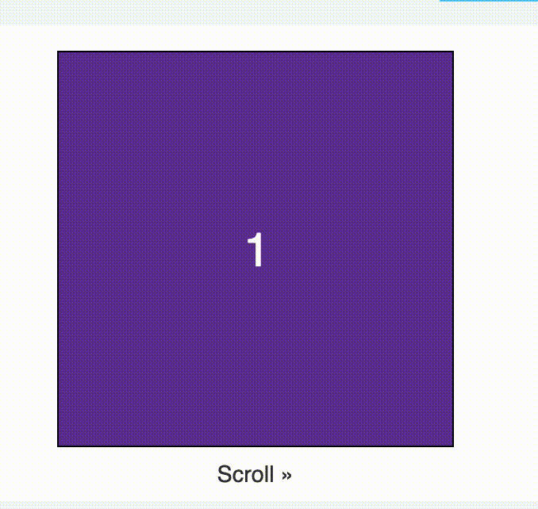

# 基于css的scroll-snap-type实现自动轮播的效果插件
## 背景
传统的 `swiper` 太重了，里面封装了很多我们不需要的功能，而一个简单的滚动功能没必要那么重的文件。于是就想着自己如何实现，如何才用最少的代码最优雅的实现呢？是否可以推翻传统的实现，使用纯 `css` 的某些特效实现呢？

肯定可以的呀，我就实现了一个基于[scroll-snap-type](https://developer.mozilla.org/en-US/docs/Web/CSS/scroll-snap-type)属性做的滚动

## 实现思路
自动轮播实现的原理就是元素位置的移动，循环滚动轮播就是位置来来回回的一直滚动。

实现原理明清楚了，那么元素位置移动可以使用哪些css属性呢？最常见的是position一系列，但是这一次我准备和你说一点别的实现方式，之前提到的[scroll-snap-type](https://developer.mozilla.org/en-US/docs/Web/CSS/scroll-snap-type)



它主要的功能是根据你滚动到的一个临界点，是滚到的原点还是滚到到终点，利用这个css属性，就可以自动判断用户是要滚到哪

那么问题又来了，这个临界点我们怎么设置呢？css 属性都是相辅相成的，[scroll-snap-align](https://developer.mozilla.org/en-US/docs/Web/CSS/scroll-snap-align) 这个属性派上用场了。她可以指定临界点是在开始还是结束还是在中间

scroll-snap-type 会根据 scroll-snap-align的设置的临界点进行滚动

轮播滚动的最主要的最核心的功能就实现了。接下来就是滚动。

这个属性[scroll-behavior](https://developer.mozilla.org/en-US/docs/Web/CSS/scroll-behavior): 可以让页面平滑的滚动，滚动的时候自带动效一点都不生硬，作为用户的我体验极好

到现在这里我们的滚动就实现了，只是此刻的滚动是需要我们手动。要想实现自动滚动，css 就没有办法帮我们实现了，需要借助js实现。

js模拟我们的滚动

```
css
.swiper-box {
  scroll-behavior: smooth;
  scroll-snap-type: x mandatory;
}
.swiper-image {
  scroll-snap-align: start;
}
js

setInterval(function () {
     var clientWidth = ele.clientWidth;
     var index = Math.floor(ele.scrollLeft / clientWidth) + 1;
     if (index > imageList.length - 1) {
       index = 0;
     }
     eleSwiperBox.scrollLeft = clientWidth * index + _ele.offsetLeft * index;
   }, 3000)
```

就是这么简单，几行代码就实现了滚动自动轮播。如上面所说用最少的代码最优雅

## 浏览器不兼容怎么办
写一个 polyfill 吧，经过测试发现在 Safari浏览器下的不会平滑滚动，生硬的瞬间滚动。到底是哪里出了问题呢？测试发现是不支持 scroll-behavior 属性。

首先我们清楚 scroll-behavior: smooth; 实现的效果是怎么样的？

是滚动的过程中缓慢的滚，有条不紊，按照一定的步长再动，好像在做移动匀速的直线运动

知道了原理就好办了在属性不支持的情况下我们就写一个递归函数，ele.scrollLeft 不是一步到位，而是慢慢的每次只滚动一点点，一直到结束


```
  if (!CSS.supports("scroll-behavior: smooth")) {
     var step = function () {
       var numScrolDistance = scrollLeft - ele.scrollLeft;
       if (Math.abs(numScrolDistance) <= 3) {
         ele.scrollLeft = scrollLeft;
       } else {
        ele.scrollLeft += numScrolDistance / 4;
         requestAnimationFrame(step);
       }
     };
     step();
   } else {
     ele.scrollLeft = scrollLeft;
   }
```

借用几个css 属性我们的自动轮播滚动效果就实现了，代码很简单，主要是css的功劳。但是这个自动轮播有一个缺陷是她没有做到一个闭环的滚动，因为我们用的是他的scrollLeft。

兼容性的问题也解决了，完美的实现了。是不是很有意思呢，全部原生 `js` 实现，简单轻量，没有框架限制。做的又不是重复性简单的活，我们还学会了几个css 属性呢，在不兼容的情况下，借助js完结解决

## 不仅仅只有轮播滚动
如果我们不做轮播滚动，做点击滚动也是很方便很好使用的属性。


像这种情况也是很好使用的。之前在项目中就实现过这个效果，但是那时候没有[css大佬坐镇指点](https://www.zhangxinxu.com/),用的是递归的滚动实现，效果实现了，但是没有用到什么有意思的属性，那时候完全没有想过用css去实现

### 代码封装一下

把上面的代码稍微封装一下，写成一个组件，在我们的在项目中就可以随意使用了，一次封装终身享用。都是原生的实现，没有框架的限制，有兼容性的处理。
还附带了图片懒加载和异常处理

[代码封装](https://github.com/yued-fe/snap-swiper)

1. 本地下载 `js/css` 使用引入使用

```
<script src="./snap-swiper.js"></script>
<script>
  var imageList = []
  SnapSwiper(imageList, '.snap-swiper-index')
</script>
```

[本地下载js使用Demo](https://jsbin.com/zezureg/6/edit?html,css,js,output)

2. 可以 `npm` 安装使用

`npm i snap-swiper`

```
import "snap-swiper/snap-swiper.css";
const snapSwiper = require("snap-swiper");
snapSwiper({
    imageList:[],
    el,
  });
```

[npm 下载使用demo](https://codesandbox.io/s/gifted-ives-zco4l?file=/index.html)

